```{r setup, include=FALSE}
knitr::opts_chunk$set(echo = TRUE)
```

Are you a tourist in Barcelona and you don't know how to use its services because you can't speak Spanish? 

Are you a resident that want to have a handy app that tells you what's going on in your big and dynamic city? 

No problem! This user-friendly and intuitive app gives you the possibility to 
have an overview over different services available in Barcelona, such as:

* Monitoring accidents with an interactive map

* Check the nearest available bike stations

* Find your favorite trees by selecting the tree species.

* Check complaints and suggestions made on a specific district.

* Find the nearest public Wi-Fi hotspot.

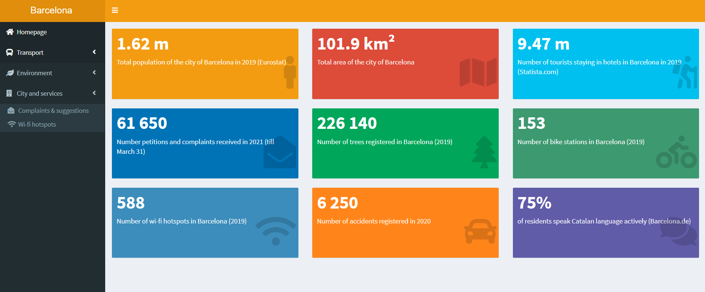


## Transportation Services {.tabset}

In this sub-menu you can check information regarding transportation services in Barcelona.
In details, you can check information regarding:

* Find out past and present incidents in a certain district
* Check which incidents involved some fatalities or not
* Find where's the nearest bike station
* Check how many bikes are available in a selected bike station and what type of bikes (electric/not electric)

### Accidents Map

You have an overview on accidents in Barcelona, the map in interactive and you can filter
by district, month and day of week in which the accident happened and if there were any fatalities.
<br><br>
You can also click on any icon to check information about:

* District in which the accidents happened
* Date of the accidents
* Number of vehicles involved
* Cause of the accident
* Number of victims and how many dead
  

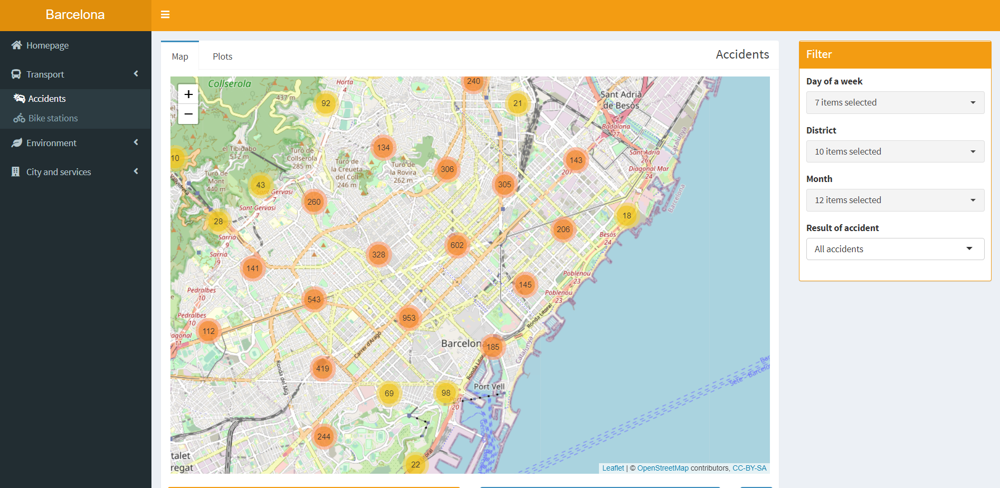 


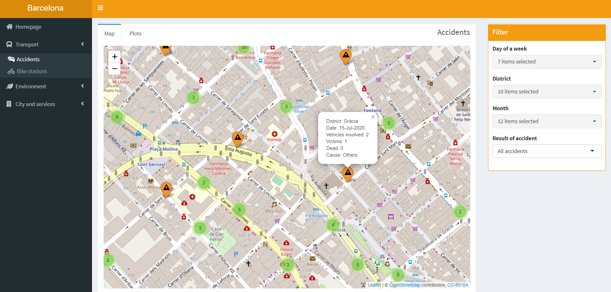


### Accidents Plot

Here you find a descriptive analysis regarding the months and the weekdays in which 
are registered the highest number of accidents, sorted by the total number in a decreasing order.

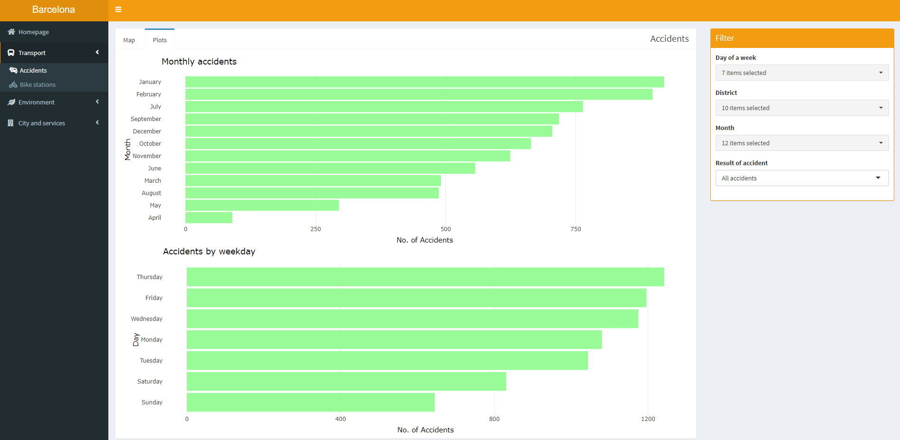


### Bike Stations Map

No more problems finding the nearest bike station, with this interactive map you can check
where's the nearest station and filter for the desired bike (electric or not). 
<br><br>
Moreover, by clicking on any icon you can check information regarding:

* Street of the bike station.
* Altitude of the bike station.
* Slots available: how any free slots available to return your bike.
* Last update: when the data was updated.

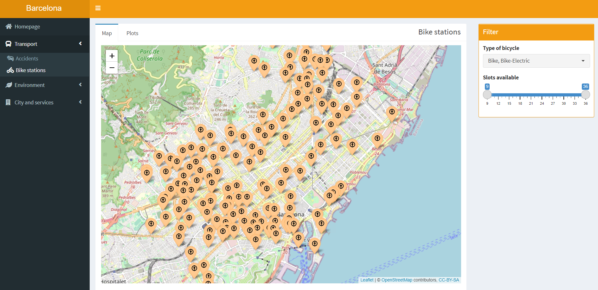


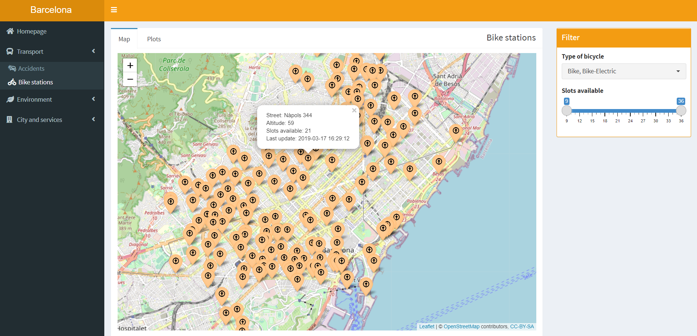


## Find your favourite tree {.tabset}

Do you have the green thumb or you like to explore and find you favourite trees? We got you covered!
Our app has a *Tree* subsection in which you can select one or more favorite 
tree species and find out where it is.

### Tree explorer

Select any tree species from the dropdown box and check where it is using the interactive map. <br>
For instance in the picture below i want to check where are *Acacia from Japan* and *Acacia from Constantinopole*

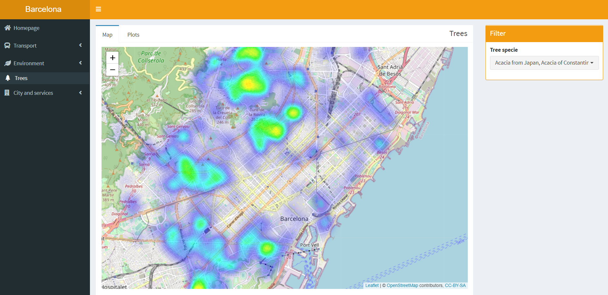

### Tree Plots

Check the descriptive statistics of the trees species you selected and find out
which districts have the highest number of the species selected and what's the distribution 
in absolute terms of those.

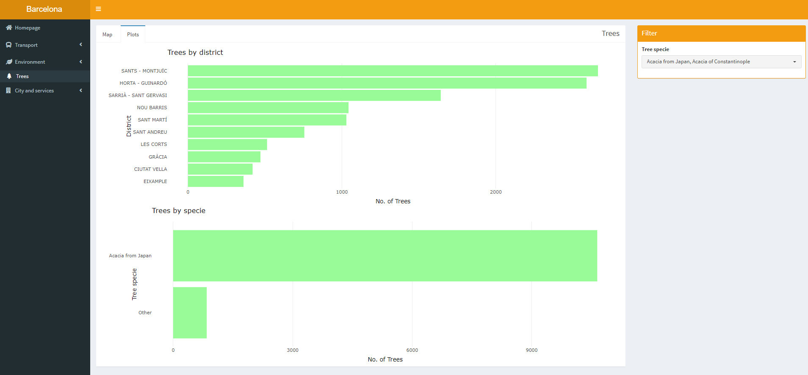


## Check complaints in your street {.tabset}

Do you want to know what's going on in your street and what other residents are
complaining about? In the complaints section you have an overview over active complaints
in your district.

Use the interactive map and check if there's any compliant in your district, you can
click on the inquiry icon and check many information such as <em>details on inquiry, 
time of submission, area involved, platform of submission, dealing time</em> and much more.

### Complaints Map

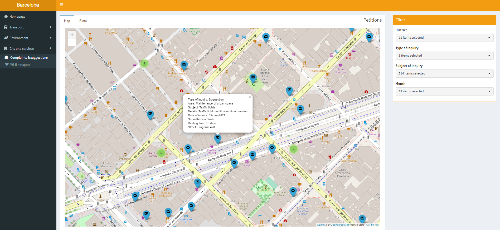


### Complaints Plot

Here you can check the most common type of inquiries in your district and much more data, 
such as the <em>channel of submission</em>.

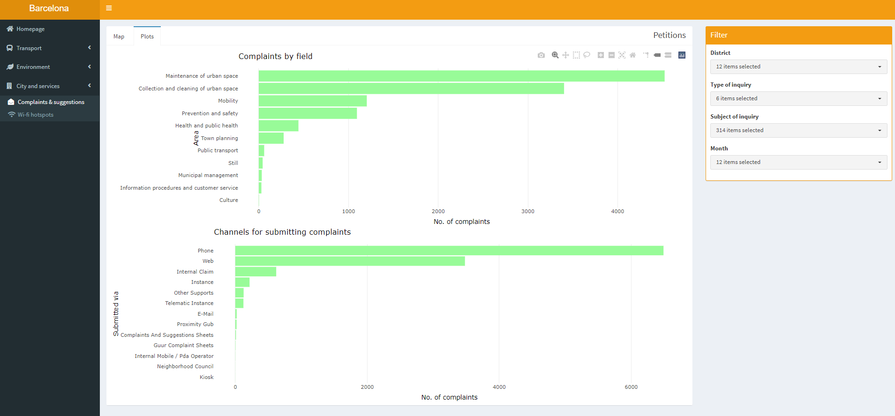


## Wi-Fi Services {.tabset}

If you're traveling to Barcelona you may need an internet connection to check how to reach 
the attractions you want to visit, or maybe to find the best restaurant nearby, or maybe 
you just want to spend the remote working/study outside and you want to find the best spot.

With our app you can find all the public Wi-Fi services available in Barcelona!


### Wi-Fi Map

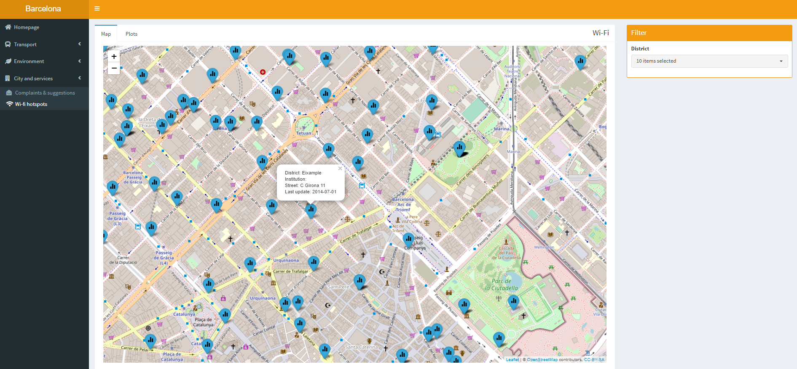


### Wi-Fi Plots


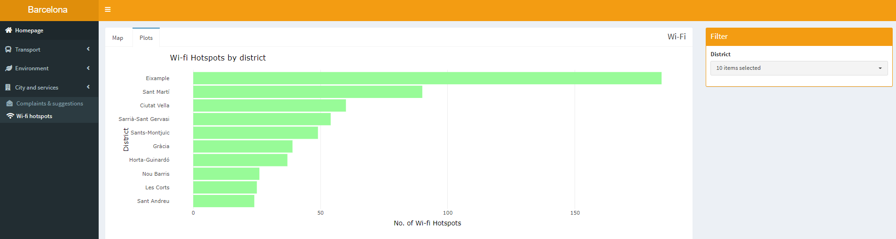


## How we created Barcelona City App

### Data preparation

All the data was acquired directly from the [Barcelona's site for open data access](https://opendata-ajuntament.barcelona.cat/en/) (under the Creative Commons Attribution 4.0). The site offers variety of data sets depicting various aspects of the city, like transport, environment, tourism, culture and therefore there is also a possibility to add more features (beyond what was already implemented) to the application in the future. More information about data sets in specific tabs can be found under the question mark below maps. 

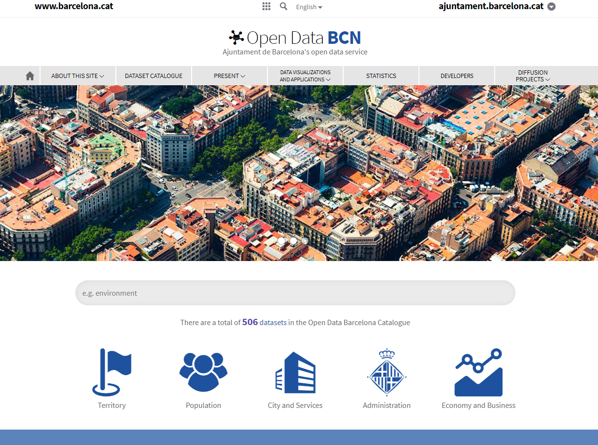

<br>

All the data has been cleaned and prepared by us for the use in the application. Since most of the data was in Catalan or Spanish, all the necessary information was translated automatically with the use of googleLanguageR package, which in hand connects to the user's Google Cloud service to use Cloud Translation API and translate the text directly in R. 

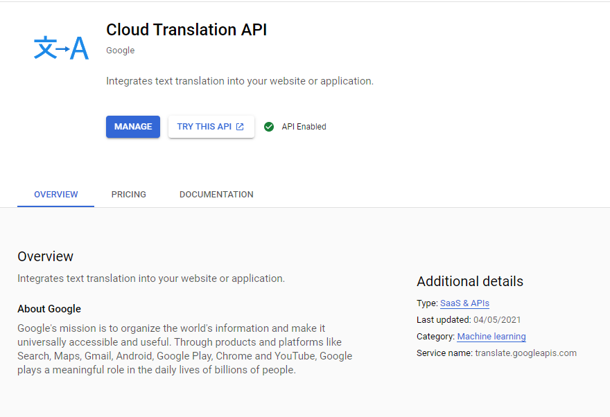{#id .class width=450px height=320px}

<br>

### R shiny

In order to let the user interact with the content and let him navigate more easily through all the possible visualizations and options, [R Shiny](https://shiny.rstudio.com/) was used to build a web application directly from R. Since the outputs change instantly as users modify inputs, without requiring a reload of the browser, we believe it is a perfect choice for applications like our, offering quick and intuitive interaction. 

{#id2 .class width=250px height=150px}

### Maps and plots

All the tabs consist of three main elements: a map, plots and filters. 

<br>

Since data included also geolocation information with coordinates, it was possible to visualize it on the map. In order to do so, [Leaflet package](https://rstudio.github.io/leaflet/) was used, a popular open-source JavaScript (also possible to use in R) library for interactive maps.

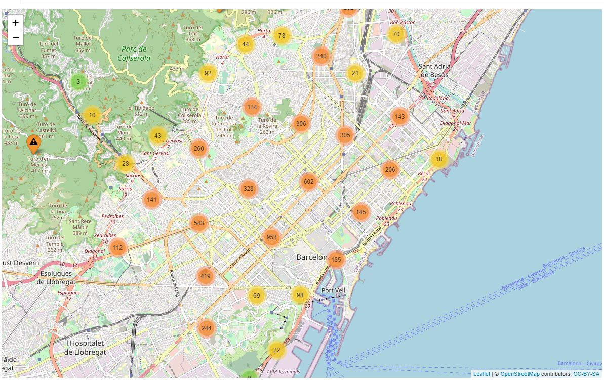 

<br>

Plots were created with the use of ggplot2 package, the most popular tool for data visualization in R, as well as [Plotly](https://plotly.com/r/), a package for interactive plots. At first, an ggplot2 object was created, which later was translated into plotly object with use of ggplotly() function. 

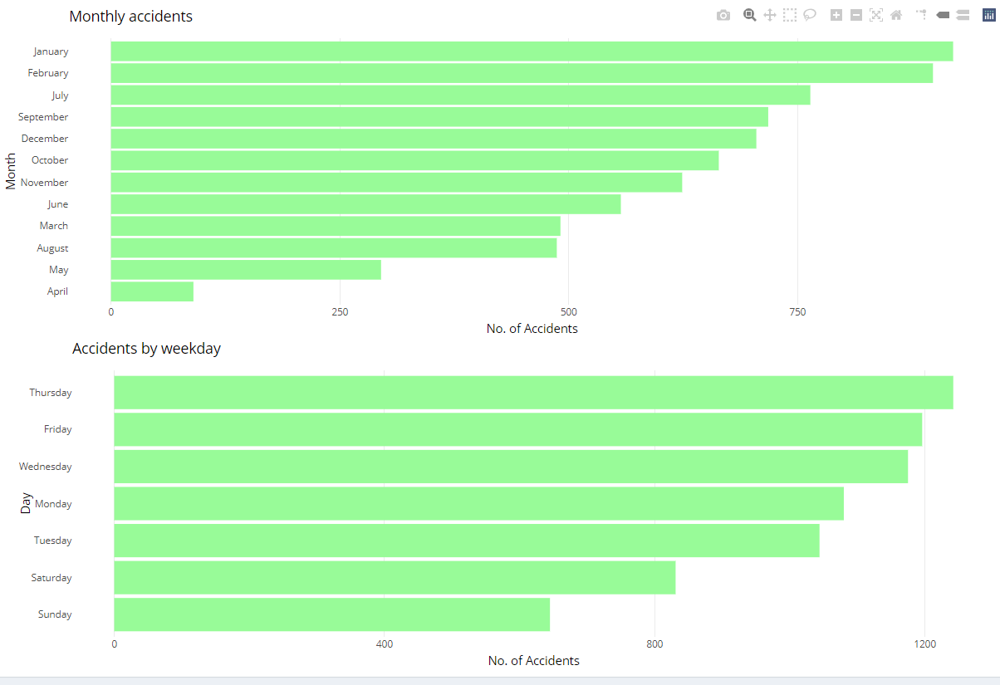

<br>

Filters used in the application consisted mainly of features offered by shinyWidgets package, which enables to use much more advanced and elastic options for selecting desired data filtering. A full showcase for available options can be found [here](http://shinyapps.dreamrs.fr/shinyWidgets/).

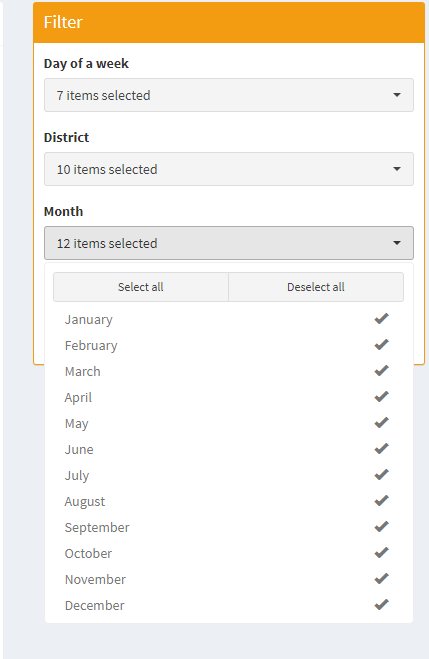
